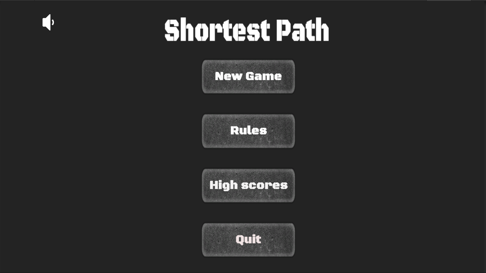
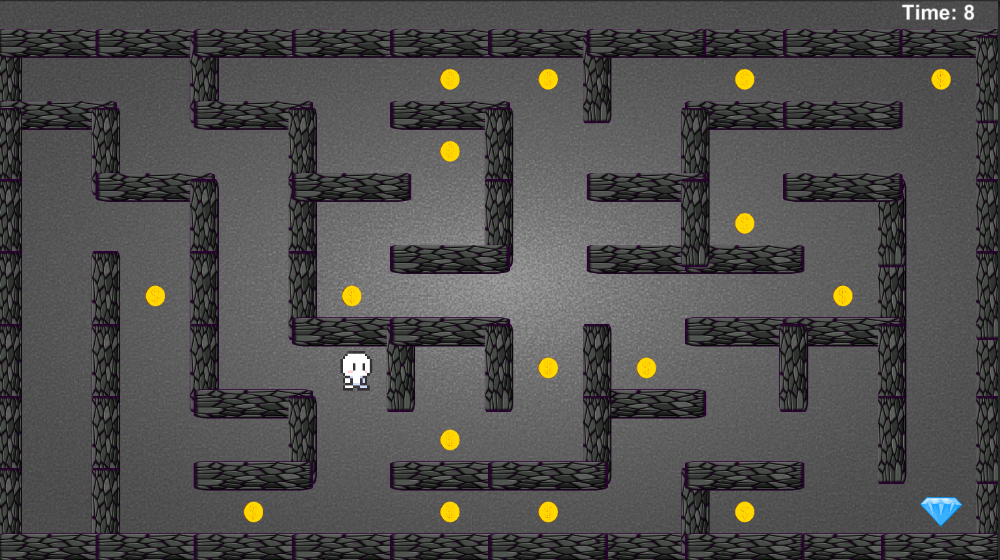
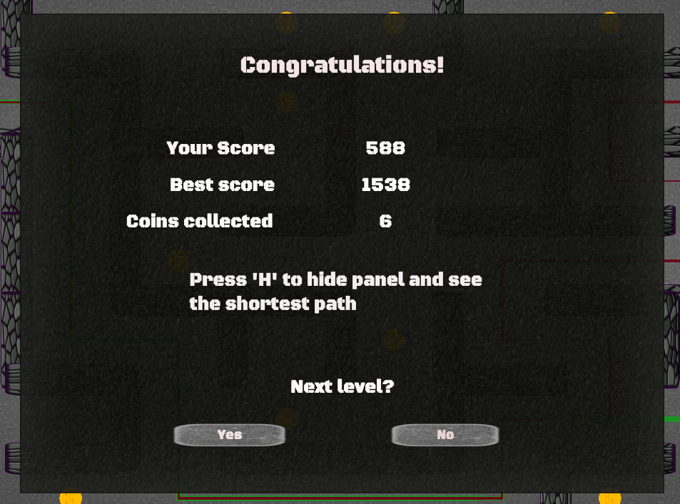
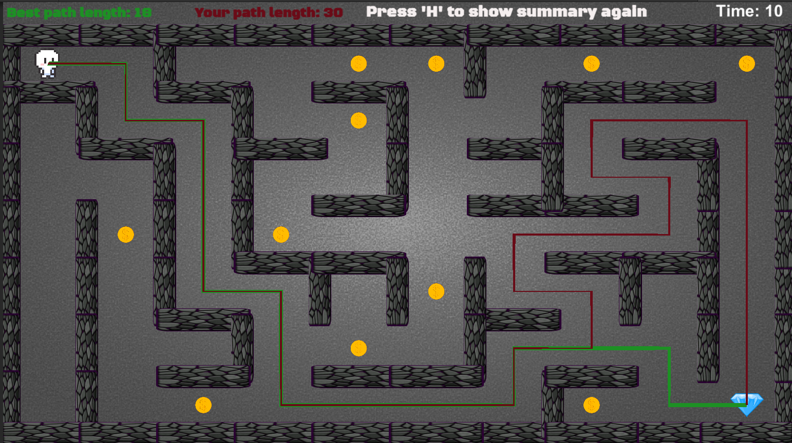
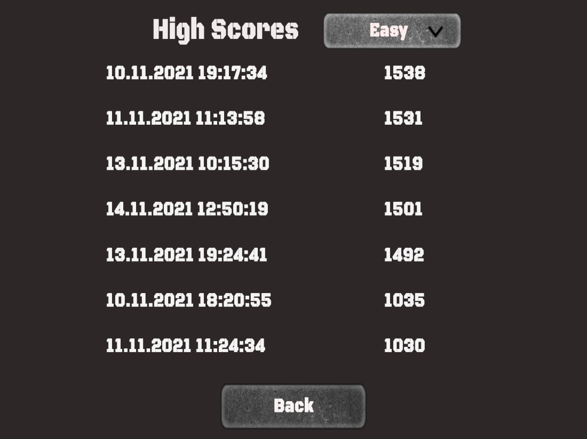

# General info
This is repository for my 2D Maze Game project, created to get engineer's degree. Graduate work contains implementation of the logic-agility game in Unity. The game goal is to choose optimal in terms of length path needed to escape the maze. It means that generated maze has few different solutions. Optimal road is calculated by graph algorithms such as A* or Dijkstra algorithm. Game also counts time spent on given level (time depends on final score). Application contains also three difficulty levels and high scores table. Game includes also additional feature - coins collectiong. Every collected coint subtracts one second from time counter. This is a single player game, playing online is yet impossible but may be added in future.

# Technologies 
Project was created in usage of
* C# 9.0
* Unity 2020.3.14f1
* Visual Studio 2019

# Setup
To run this application download contents of 'Deployed version' folder and simply double click on .exe file. You need to use Windows to run the app.

# Status
Projects is finished, but I possibly will add some new fetures in future.

# Images
 ## Main menu 
 

 ## Gameplay
 
 This image shows gameplay on easy level. 
 
  ## Gameplay
 
 After finishing level player can see his score, data about collected coins and time needed to complete the level.
 
   ## Paths panel
 
 After finishing level player can also compare best possible path and path chosen by himself.
 
   ## High scores
 
Hogh scores table is divided into three parts depending on difficulty level.
